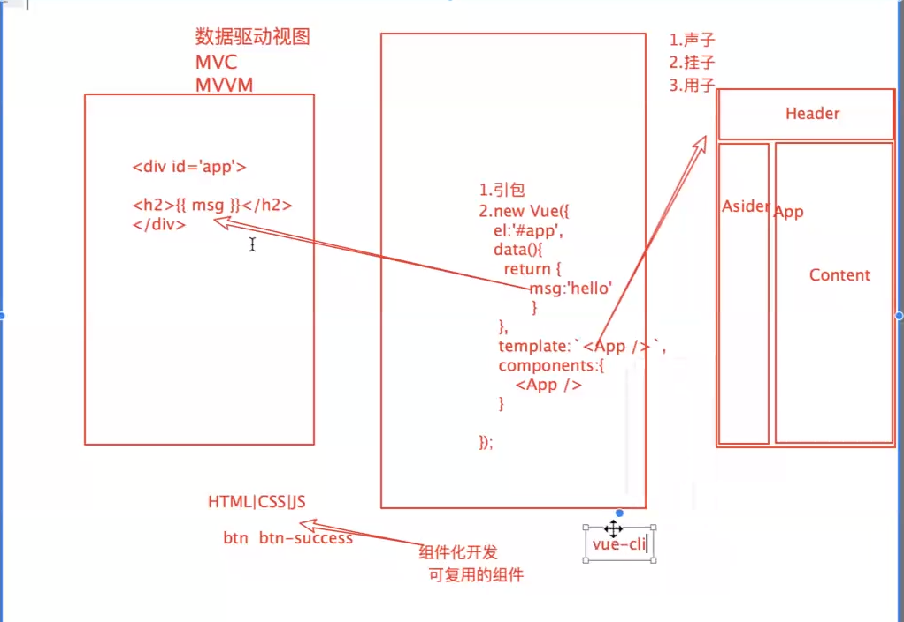

# vue深入学习  数据驱动视图
### 局部组件的使用：
test3-1
1. 声明子组件（首字母最好大写） `var App={ }`
2. 挂载子组件 `components:{ App }`
3. 使用子组件（标签使用） ```  template:`<App></App> `   ```，其中可简写为`<App />`



### 父组件的使用
test3-2
```
//创建全局组件,第一个参数是组建的名字，第二个参数是options

        Vue.component("Vbtn", {
            template: `
                <button>按钮</button>
            `
        })
```

### 父组件通过props往子组件通信
```
       Vue.component("Child", {
            template: `
                <div>
                    <p> 我是一个孩子组件   {{childData}} </p>
                    <input type="text" v-model="childData" />
                </div>
            `,
            props: ["childData"]
        })


        //父===>子
        //1.先在父组件中绑定自定义的属性  <Child：childData="msg" /> 
        //2.在子组件中使用props接收父组件传递的数据    props:["childData"]
        //3.可以在子组件中任意使用    <input type="text" v-model="childData" />   {{childData}}

        Vue.component("Parent", {
            data() {
                return {
                    msg: "我是父组件的数据"
                }
            },
            template: `
                <div>
                    <p> 我是一个父组件 </p>
                    <Child :childData="msg" /> 
                </div>
            `
        })
```